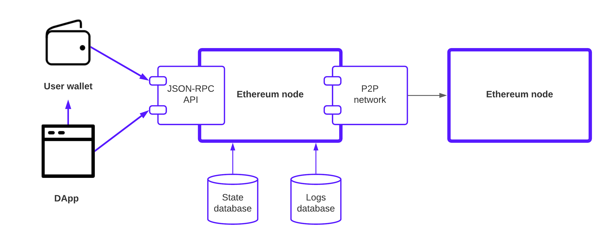

# Overview and architecture

### Introduction

The tEVM improves on the EVM by implementing it’s own version of the EVM. Telos smart contracts and dApps are written in C++ and compiled to WebAssembly (WASM) code. Any native C++ based smart contract is executed on Telos Zero network and no transaction fee is currently charged. It is totally free. Telos Zero fees are set by block producers and voted by token holders.

**Telos has implemented the original EVM as a smart contract on the tEVM.**

EVM transactions, that go through the tEVM, will have a fee model similar to the native Ethereum gas model. The Ethereum account needs to have TLOS tokens on their [tEVM wallet account](../../quickstart/wallets/setting-up-wallets.md#telos-evm) to pay for the transactions (or code execution). Telos EVM fees are fixed at < 0.1% of Ethereum gas fees for identical transactions. No front-running or miner extracted value (MEV) can occur on tEVM due to tEVM’s first-in-first-out mempool structure.&#x20;

The tEVM produces two new blocks every second, which leaves little time for bots to scan the mempool for valuable trades. Furthermore, a fixed-rate gas fee on tEVM transactions means that no one can jump ahead of another person by offering a higher gas fee. Most important of all, Telos is a blockchain that’s governed by its community, with clear rules of what its validators are allowed to do and the penalties for breaking these rules. On Telos, all block producers must process transactions on a first-in-first-out basis, as they receive them. Transactions cannot be reordered for profit.

### Classical Ethereum Setup

To understand how EVM works on Telos, we need to first look at how EVM based dApps usually work.

Below is an illustration of a classical EVM decentralized app design. Both the dApp and user wallet connects to an Ethereum node that provides API services over JSON-RPC protocol. The Ethereum node manages the state (accounts and balances) and logs (queries of events) for its API user in internal databases (state database and logs database respectively).

The two EVM databases are

* **State database** that store the current network state which is accessible to the smart contracts. Smart contracts have the ability to update and read data from the database.
* **Logs database** that stores the past Solidity events. It is mainly used for token transfers, centralized exchange integration and dapp transaction histories. Smart contracts cannot access logs.

dApps communicate with the user wallet over [in-browser ](https://docs.metamask.io/guide/ethereum-provider.html)or [WalletConnect](https://walletconnect.org) protocols. Both user wallet and dApps communicate with Ethereum JSON-RPC API to get the blockchain state and logs.

### Telos EVM design

Since the EVM is implemented on Telos as a smart contract, all activities that would normally be run by the EVM on an Ethereum node are run by a smart contract on the Telos blockchain. An Ethereum compatibility JSON-RPC server provides the API Ethereum applications are expecting. It does this by translating the Telos Zero state from the EVM smart contract to Ethereum expected format.

Most important of all, Telos is a blockchain that’s governed by its community, with clear rules of what its validators are allowed to do and the penalties for breaking these rules.&#x20;

On Telos, all block producers must process transactions on a first-in-first-out basis, as they receive them. Transactions cannot be reordered for profit. Block time and consensus algorithms affect how fast a transaction is finalized, and how interactive dApps can be.&#x20;

Telos can process 10 000 transactions per second (TPS) using a fraction of the energy that other blockchain networks, making it the most efficient blockchain currently available.

The Telos EVM can be used with all of the common tools used on other EVMs (remix, hardhat, truffle, web3, ethers.js, etc..) and we encourage using those mature tools from the ecosystem.While for end users there should be no noticeable difference, it may be interesting to know some differences.&#x20;

Here are some of the main differences between the Telos EVM and other EVMs such as go-ethereum:&#x20;

* Gas price is fixed, you can enter a higher price but will only be charged the current set price, you cannot enter a lower price or the transaction will be rejected (no gas charged). This means you cannot front run other transactions or speed yours up, but block times are .5 seconds so there is no need to speed them up.&#x20;
* Since the EVM is just another smart contract on the Telos blockchain, multiple EVMs can exist on the same chain at the same time. They are differentiated by their Telos account name. They are differentiated by their Telos account name. There is currently only one EVM on Telos, under the “eosio.evm” account name for both mainnet and testnet. &#x20;
* Telos does not have the concept of logs, whereas Ethereum nodes provide the built-in eth\_getLogs call to query logs. Telos has logs query/streaming and history management as an external service called [Hyperion](https://eosrio.io/hyperion/).
* EVM transactions are relayed to the EVM contract via a Telos Zero transaction, which means Telos Zero resources still are needed in the transaction lifecycle. This process is managed by the Ethereum compatibilbe JSON-RPC server that has a Telos Zero account associated with it which manages the resources. This account is used for broadcasting transactions to the EVM contract. &#x20;
* EVM smart contract uses TLOS Zero token as gas instead of ETH. More can be read on gas fees [here](./gas-fees.md).

## Sentnl Approved EVM

The tEVM was meticulously audited and approved by Sentnl ([read more here](https://www.telos.net/news/telos-evm-approved-audit-certificate-received)). The audit conducted by Sentnl on the tEVM led to the discovery of a security vulnerability in the original Go Ethereum (Geth) code illustrating the quality control involved in developing the tEVM.

### Other similar projects

A similar approach is followed by the [Near blockchain](https://github.com/aurora-is-near/aurora-engine) to construct an EVM from smart contracts.
